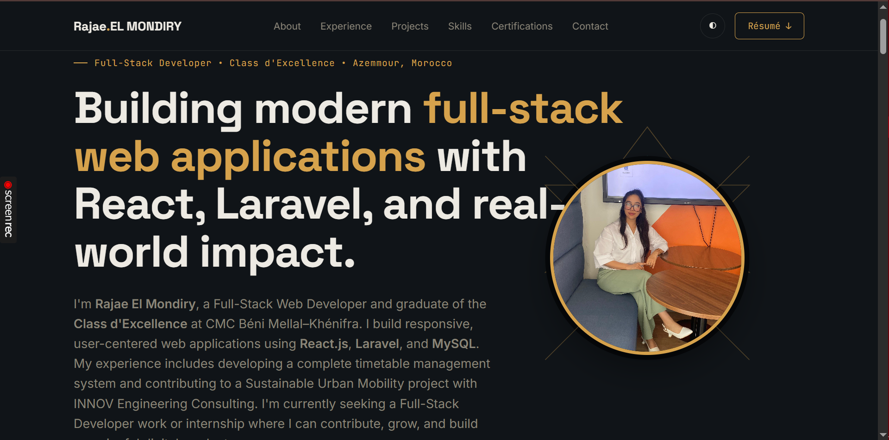

# 🌐 Rajae El Mondiry — Portfolio

A modern, responsive personal portfolio showcasing my projects, technical skills, education, and professional experience as a Full-Stack Web Developer.

🔗 **Live Demo:** [https://my-portfolio-eight-kappa-32.vercel.app/](https://my-portfolio-eight-kappa-32.vercel.app/)

---

## 📖 About

This portfolio was designed and developed to present my work, technical expertise, and professional journey in a clean and interactive way.

It highlights my experience in Full-Stack Web Development, featuring real-world projects built with modern web technologies, a responsive user interface, dark/light mode, smooth animations, and an integrated downloadable résumé.

---

## ✨ Features

- Responsive design for desktop, tablet, and mobile
- Dark / Light theme
- Smooth scroll animations
- Interactive project showcase
- Downloadable résumé
- Contact section
- Clean modern UI
- Optimized performance
- Deployed with Vercel

---

## 🛠️ Technologies Used

- HTML5
- CSS3
- JavaScript (ES6)
- Responsive Design
- Git
- GitHub
- Vercel

---

## 🚀 Featured Projects

### 📅 Timetable Management System
A full-stack scheduling platform built during my Full-Stack training to manage classes, instructors, rooms, and timetable generation using React, Laravel, and MySQL.

**Tech Stack**
- React.js
- Laravel
- PHP
- MySQL
- Tailwind CSS

---

### 🌍 MZIWDA — Social Web Platform

A modern social media interface developed with reusable React components and API integration.

**Tech Stack**

- React.js
- REST APIs
- State Management

---

### 🎨 Universal Converters

A utility web application including:

- Color Converter
- Decimal ↔ Binary Converter
- Random Color Generator
- Copy-to-Clipboard
- Responsive Design

**Tech Stack**

- HTML
- CSS
- JavaScript

---

### 🎂 Age Calculator

A responsive JavaScript application that calculates a user's exact age in years, months, and days.

**Tech Stack**

- HTML
- CSS
- JavaScript

---

## 💼 Experience

### INNOV Engineering Consulting
Field Survey Agent

- Participated in the Sustainable Urban Mobility Plan for Béni Mellal.
- Collected and verified transportation data.
- Conducted field surveys and contributed to urban planning research.

---

## 🎓 Education

- Diploma in Full-Stack Web Development — CMC Béni Mellal–Khénifra
- Web Development Training — OFPPT Béni Mellal–Khénifra
- Baccalaureate

---

## 📬 Contact

**Rajae El Mondiry**

📧 Email: elmondiryrajae@gmail.com

💼 LinkedIn:
https://www.linkedin.com/in/rajae-el-mondiry/

💻 GitHub:
https://github.com/RajaeElmondiry

🌐 Portfolio:
https://my-portfolio-eight-kappa-32.vercel.app/

---

## 📸 Preview

---

## ⭐ Repository

If you like this project, don't forget to leave a ⭐ on the repository!
